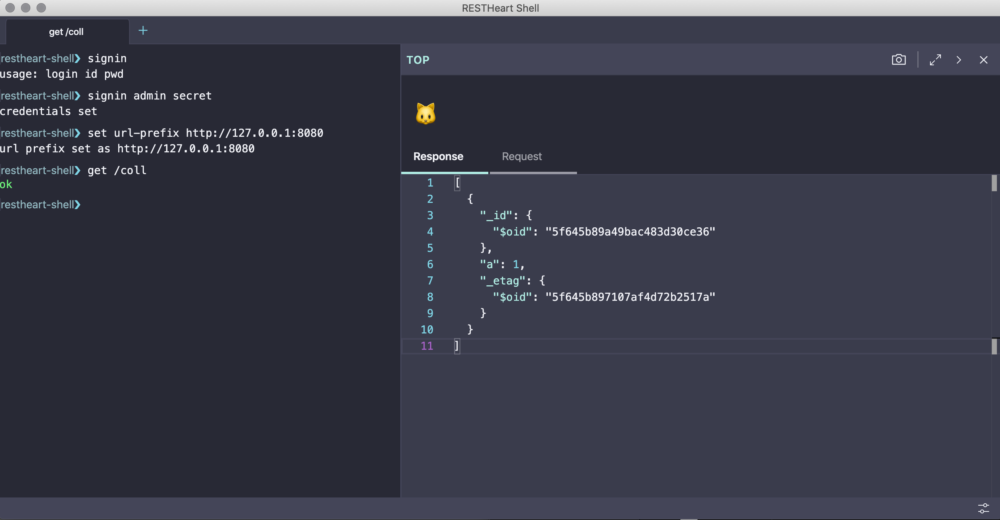

# RESTHeart Shell

**RESTHeart Shell** is a CLI tool that provides developers a modern alternative to http clients for interacting with RESTHeart.



## Alpha stage

Note: this project is at alpha stage. Heavy work in progress!

## How to run

```
$ npm ci
$ npm run watch
```

Then in other terminal

```
$ npm run open
```

## Get help

As soon as the shell starts, get commands usage help with:

```
restheart-shell> help restheart
```

## Contribute

[GitHub](https://github.com/softinstigate/restheart-shell "RESTHeart Shell's GitHub page")

[Bugs](https://github.com/softinstigate/restheart-shell/issues/new "RESTHeart Shell's bug reporting page")
