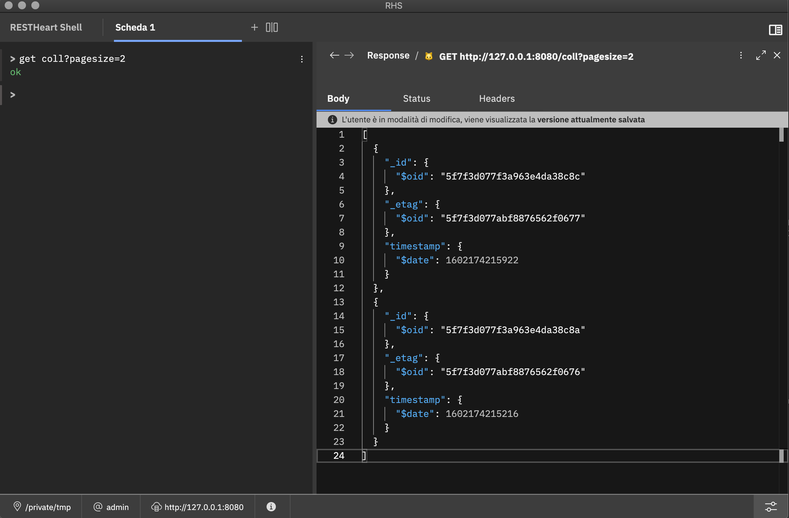

# RESTHeart Shell

**RESTHeart Shell** is a CLI tool that provides developers a modern alternative to http clients for interacting with RESTHeart.



## Alpha stage

Note: this project is at alpha stage. Heavy work in progress!

## Usage

First step:

```sh
npm ci
```

Next, choose your adventure from the following variants:

### Variant 1: I want to develop an Electron client

Use these commands while developing. The first starts up the webpack
watcher. Each time you execute the second, an Electron window will
open.

```sh
npm run watch
npm run open
```

And use one of these commands to build production clients, after which
your clients will be placed in `./dist/electron`.

```sh
npm run build:electron:all
npm run build:electron:mac
npm run build:electron:linux
npm run build:electron:windows
```

### Variant 2: I want to develop a browser-based client

Use this command while developing:

```sh
npm run watch:source
npm run watch:webpack
```

Then visit http://localhost:9080. To build a production set of webpack
bundles, use this command:

```sh
npx kui-build-webpack
```

## Get help

As soon as the shell starts, get commands usage help with:

```
> help restheart
```

## Acknowledgments

Project derived from [AnimalApp Kui skeleton project](https://github.com/IBM/kui/tree/master/docs/example/AnimalApp)

## Contribute

[GitHub](https://github.com/softinstigate/restheart-shell "RESTHeart Shell's GitHub page")

[Bugs](https://github.com/softinstigate/restheart-shell/issues/new "RESTHeart Shell's bug reporting page")
