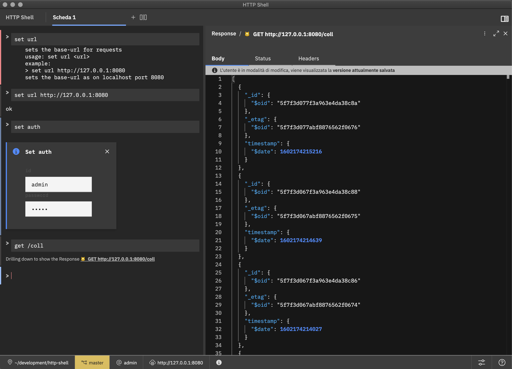

# HTTP Shell

**HTTP Shell** provides developers with a modern alternative to HTTP clients for interacting with APIs. Let's see it as something between a low-level command line interface, like curl or httpie, and a more user friendly GUI client, like Postman. The idea is that tools like curl are very powerful but a bit cumbersome, it is often hard for us to remember the exact syntax for each HTTP verb. HTTP Shell instead is still a command line interface, but with a much straightforward user experience.

HTTP Shell is a tool built on top of IBM's open source [Kui framework](https://github.com/IBM/kui).

> Kui combines the power of familiar CLIs with visualizations in high-impact areas. Kui enables you to manipulate complex JSON and YAML data models, integrate disparate tooling, and provides quick access to aggregate views of operational data.



## Installation

We offer prebuilt images for Windows, MacOS and Linux.

Get _HTTP Shell_ binary from the [releases download page](https://github.com/SoftInstigate/http-shell/releases)

## Usage

Find more **HTTP Shell**'s usage information, commands and examples on [RESTHeart documentation](https://restheart.org/docs/plugins/dev-env/).

## Build from source

First step:

```sh
npm ci
```

Next, choose your journey from the following variants:

### Variant 1: I want to develop an Electron client

Use these commands while developing. The first starts up the Webpack
watcher. Each time you execute the second, an Electron window will
open.

```sh
npm run watch
npm run open
```

And use one of these commands to build production clients, after which
your clients will be placed in `./dist/electron`.

```sh
npm run build:electron:all
npm run build:electron:mac
npm run build:electron:linux
npm run build:electron:windows
```

### Variant 2: I want to develop a browser-based client

Use this command while developing:

```sh
npm run watch:source
npm run watch:webpack
```

Then visit http://localhost:9080. To build a production set of Webpack
bundles, use this command:

```sh
npx kui-build-webpack
```

## Get help

As soon as the shell starts, get commands usage help with:

```
> help http-shell
```

## Acknowledgments

Project derived from [AnimalApp Kui skeleton project](https://github.com/IBM/kui/tree/master/docs/example/AnimalApp)

## Contribute

[GitHub](https://github.com/softinstigate/http-shell "HTTP Shell's GitHub page")

[Bugs](https://github.com/softinstigate/http-shell/issues/new "HTTP Shell's bug reporting page")
